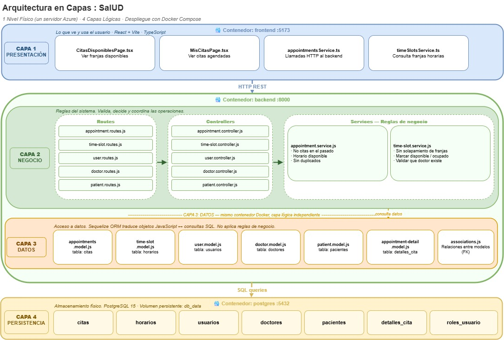

# Arquitectura del Sistema — SalUD

## 1. Arquitectura General

SalUD es un sistema web de gestión de citas médicas para pacientes y doctores.

### Componentes

| Componente | Tecnología | Puerto |
|---|---|---|
| Frontend Principal | React + Vite | 5173 |
| Backend | Node.js + Express | 8000 |
| Base de datos | PostgreSQL 15 | 5432 |
| RabbitMQ (eventos) | RabbitMQ | 5672 |
| notificacion_orden | Worker Node.js | — |
| MF Medicamentos (microfrontend) | React + Vite | 8081 |
| medicamentos-service | Python / FastAPI | 8001 |
| Base de datos medicamentos | PostgreSQL 15 | 5433 |

### Despliegue: 1 servidor físico (Azure for Students)

Todo corre en **un solo servidor** usando Docker Compose. Cada componente
vive en su propio contenedor Docker, aislado de los demás. Se eligió un
solo servidor por costo, simplicidad y porque la escala del proyecto lo permite.

## 2. Arquitectura en Capas — Monolito SalUD

### Despliegue físico: 1 nivel (Single-Tier)

Todo el sistema se despliega en **un único servidor físico** hospedado en
**Azure for Students**, usando **Docker Compose** para gestionar los
contenedores.

Aunque el sistema tiene múltiples componentes, todos corren en la misma
máquina dentro de contenedores Docker aislados entre sí.

#### ¿Por qué un solo servidor?

- **Costo:** Azure for Students tiene créditos limitados. Tener múltiples
  servidores aumentaría el costo sin beneficio real para el volumen de
  usuarios del proyecto.

- **Escala del proyecto:** SalUD es un sistema académico con una cantidad
  reducida de usuarios simultáneos. Un solo servidor es suficiente para
  atender la carga esperada.

- **Simplicidad:** Con Docker Compose, todos los contenedores se inician,
  detienen y actualizan con un solo comando, lo que simplifica la
  administración del sistema.

- **Aislamiento garantizado:** Aunque estén en el mismo servidor físico,
  cada contenedor Docker funciona de forma independiente. El frontend no
  puede afectar al backend, ni el backend a la base de datos, sin pasar
  por las interfaces definidas entre ellos.

## 2. Arquitectura Detallada de Capas

---

### Principio de capas

## 2. Arquitectura Detallada de Capas - SalUD

SalUD está organizado
internamente siguiendo una **arquitectura en capas**, donde cada capa
tiene una responsabilidad única y bien definida.

---

### Las 4 Capas de SalUD

#### Capa 1 — Presentación

**Contenedor Docker:** `frontend :5173`  
**Tecnología:** React + Vite + TypeScript

Es lo que el usuario ve en su navegador. Su única responsabilidad es mostrar información y capturar acciones del usuario (clics, formularios). No toma ninguna decisión de negocio: simplemente envía solicitudes al backend y muestra las respuestas.

| Archivo | Función |
|---|---|
| `CitasDisponiblesPage.tsx` | Pantalla donde el paciente ve y reserva franjas horarias |
| `MisCitasPage.tsx` | Pantalla donde el paciente ve sus citas agendadas |
| `appointmentsService.ts` | Realiza las llamadas HTTP al backend para citas |
| `timeSlotsService.ts` | Realiza las llamadas HTTP para franjas horarias |

**Comunicación con la capa siguiente:** HTTP REST — envía y recibe datos en formato JSON.

---

#### Capa 2 — Negocio

**Contenedor Docker:** `backend :8000`  
**Tecnología:** Node.js + Express

Es el "cerebro" del sistema. Aquí se aplican todas las reglas que definen cómo funciona SalUD. Tiene tres componentes internos que trabajan en cadena:

**Routes** — Reciben las peticiones HTTP y las dirigen al controlador correcto:

| Archivo | Peticiones que maneja |
|---|---|
| `appointment.routes.js` | Crear cita, cancelar cita, ver citas |
| `time-slot.routes.js` | Crear franjas, consultar disponibilidad |
| `user.routes.js` | Registro, inicio de sesión |
| `doctor.routes.js` | Gestión de doctores |
| `patient.routes.js` | Gestión de pacientes |

**Controllers** — Coordinan el flujo de cada operación: reciben la petición del Route, llaman al Service correspondiente y devuelven la respuesta.

**Services** — Aplican las reglas de negocio:

| Archivo | Reglas que aplica |
|---|---|
| `appointment.service.js` | ¿La cita es en fecha futura? ¿El horario está libre? ¿El paciente ya tiene cita en ese horario? |
| `time-slot.service.js` | ¿La franja se solapa con otra del mismo doctor? ¿El doctor existe y está disponible? |

**Comunicación con la capa siguiente:** Llama a los modelos de Sequelize (Capa 3) para leer o guardar datos.

---

#### Capa 3 — Datos

**Contenedor Docker:** `backend :8000` *(mismo contenedor que Capa 2, separación lógica por carpetas)*  
**Tecnología:** Sequelize ORM

Esta capa es el "traductor" entre el código JavaScript y la base de datos SQL. **No aplica reglas de negocio**: su única función es convertir las instrucciones del código en consultas SQL y devolver los resultados.

> Ejemplo: cuando el Service pide "dame todas las citas del paciente con id=5", el Model traduce eso automáticamente a `SELECT * FROM citas WHERE id_paciente = 5`.

| Archivo | Tabla en la base de datos |
|---|---|
| `appointments.model.js` | `citas` |
| `time-slot.model.js` | `horarios` |
| `user.model.js` | `usuarios` |
| `doctor.model.js` | `doctores` |
| `patient.model.js` | `pacientes` |
| `appointment-detail.model.js` | `detalles_cita` |
| `associations.js` | Define las relaciones entre tablas (claves foráneas) |

> **Nota sobre la separación lógica:** Aunque Capa 2 y Capa 3 corren en el mismo contenedor Docker, están separadas en carpetas distintas dentro del código (`/services` vs `/models`). Esto garantiza que la lógica de negocio nunca se mezcla con el acceso a datos.

**Comunicación con la capa siguiente:** Genera y ejecuta consultas SQL hacia PostgreSQL.

---

#### Capa 4 — Persistencia

**Contenedor Docker:** `postgres :5432`  
**Tecnología:** PostgreSQL 15

Es donde los datos viven de forma permanente. No tiene lógica de programación: es la base de datos que almacena toda la información del sistema.

| Tabla | Contenido |
|---|---|
| `usuarios` | Datos de acceso de todos los usuarios del sistema |
| `doctores` | Datos específicos de los médicos |
| `pacientes` | Datos específicos de los pacientes |
| `horarios` | Franjas de tiempo disponibles de cada doctor |
| `citas` | Citas agendadas entre pacientes y doctores |
| `detalles_cita` | Información adicional de cada cita (diagnóstico, notas) |
| `roles_usuario` | Relación entre usuarios y sus roles (paciente, doctor, admin) |

Los datos se guardan en un **volumen Docker** llamado `db_data`, lo que garantiza que no se pierdan cuando el contenedor se reinicia.

---
## 3. Arquitectura Detallada de Capas — Microservicio Medicamentos

El microservicio de medicamentos es un sistema **completamente independiente** del monolito: tiene su propio lenguaje de programacion, su propio servidor y su propia base de datos. Aunque comparte el mismo servidor fisico (Azure), funciona de forma autonoma.

Tambien sigue una arquitectura en 4 capas, pero adaptada al lenguaje Python y al framework FastAPI.

> **Diferencia clave con el monolito:** En Node.js existen Routes y Controllers por separado. En Python/FastAPI, el **Router** cumple ambas funciones en un solo archivo — recibe la peticion Y la coordina al Service directamente, sin necesitar un Controller aparte.

---

### Las 4 Capas del Microservicio

#### Capa 1 — Presentacion

**Contenedor Docker:** `medicaments-microfrontend :8081`
**Tecnologia:** React + Vite + TypeScript

Es la pantalla que ve el gestor de medicamentos para consultar y gestionar medicamentos. Es una aplicacion React completamente independiente que se incrusta dentro del Frontend Principal usando **Module Federation** — el medico no nota que es un sistema separado, lo ve todo como una sola aplicacion.

| Archivo | Funcion |
|---|---|
| `MedicamentsList.tsx` | Lista de medicamentos con su inventario disponible |
| `MedicamentsModule.tsx` | Modulo principal expuesto al frontend via Module Federation |
| `medicamentsService.ts` | Llamadas HTTP al medicaments-service |

**Comunicacion con la capa siguiente:** HTTP REST al medicaments-service en el puerto 8001.

---

#### Capa 2 — Negocio

**Contenedor Docker:** `medicaments-service :8001`
**Tecnologia:** Python + FastAPI

Es el cerebro del microservicio. Valida y aplica las reglas del negocio de medicamentos. A diferencia del monolito, en FastAPI el **Router** hace el trabajo de Routes y Controllers al mismo tiempo.

**Router** — Recibe las peticiones y las dirige al service correcto:

| Archivo | Funcion |
|---|---|
| `medicaments_route.py` | Define todos los endpoints HTTP del microservicio |
| `dependencies.py` | Gestiona la conexion con la base de datos para cada peticion |

**Services** — Aplican las reglas de negocio:

| Archivo | Reglas que aplica |
|---|---|
| `medicaments_service.py` | Consultar y registrar medicamentos |
| `inventory_service.py` | Verificar y actualizar el inventario disponible |
| `movement_service.py` | Registrar entradas y salidas de medicamentos |

**Comunicacion con la capa siguiente:** Llama a los Repositories y Models (Capa 3) para leer o guardar datos.

---

#### Capa 3 — Datos

**Contenedor Docker:** `medicaments-service :8001` *(mismo contenedor que Capa 2, separacion logica por carpetas)*
**Tecnologia:** SQLAlchemy ORM + Repository Pattern

Esta capa tiene dos partes. Los **Models** definen como se ven los datos en Python, y los **Repositories** son los unicos autorizados a hablar con la base de datos.

> Esta separacion extra se llama **Repository Pattern** y tiene una ventaja: si en el futuro se cambia la base de datos, solo se modifica el Repository sin tocar el resto del codigo.

**Models** (SQLAlchemy ORM — traduce objetos Python a SQL):

| Archivo | Tabla en la base de datos |
|---|---|
| `medicament_model.py` | `medicamentos` |
| `inventory_model.py` | `inventario` |
| `movement_model.py` | `movimientos` |

**Repositories** (unico punto de acceso a la base de datos):

| Archivo | Que gestiona |
|---|---|
| `medicaments_repository.py` | Consultas y registros de medicamentos |
| `inventory_repository.py` | Consultas y actualizaciones de inventario |
| `movement_repository.py` | Registro del historial de movimientos |

**Comunicacion con la capa siguiente:** Genera y ejecuta consultas SQL hacia PostgreSQL BD2.

---

#### Capa 4 — Persistencia

**Contenedor Docker:** `postgres BD2 :5433`
**Tecnologia:** PostgreSQL 15

Es la base de datos **exclusiva del microservicio** — completamente separada de la base de datos principal del monolito. Esta separacion es una de las caracteristicas mas importantes de los microservicios: cada servicio es dueño de sus propios datos.

| Tabla | Contenido |
|---|---|
| `medicamentos` | Nombre y registro de cada medicamento disponible |
| `inventario` | Cantidad total disponible de cada medicamento |
| `movimientos` | Historial de entradas y salidas (quien lo hizo, cuanto, cuando) |

---

### Resumen del Microservicio

| # | Capa | Contenedor | Tecnologia | Responsabilidad |
|---|---|---|---|---|
| 1 | Presentacion | `medicaments-microfrontend :8081` | React + Vite | Interfaz del medico para medicamentos |
| 2 | Negocio | `medicaments-service :8001` | Python + FastAPI | Router + Services (reglas del sistema) |
| 3 | Datos | `medicaments-service :8001` | SQLAlchemy + Repositories | Acceso y traduccion a SQL |
| 4 | Persistencia | `postgres BD2 :5433` | PostgreSQL 15 | Base de datos exclusiva del microservicio |

---

##  Recursos de Edición

Los diagramas pueden ser editados directamente en **Draw.io** (diagrams.net). 

| Diagrama | Enlace de Edición |
| :--- | :--- |
| **1. Arquitectura General** | [🔗 Abrir en Google Drive](https://drive.google.com/file/d/1kffo73vZDxnEAT-TWTamoV2Y3dGbxe5u/view?usp=sharing) |
| **2. Diagrama de Capas** | [🔗 Abrir en Google Drive](https://drive.google.com/file/d/1b0HxPSArQGBfAZN1CvM3dtpBij3eoq98/view?usp=sharing) |

