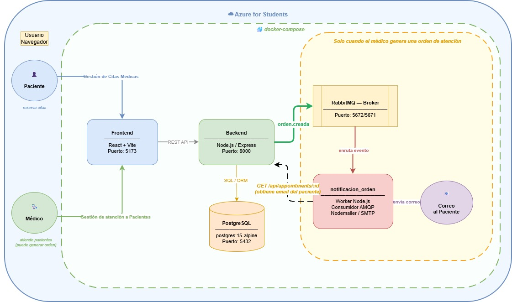
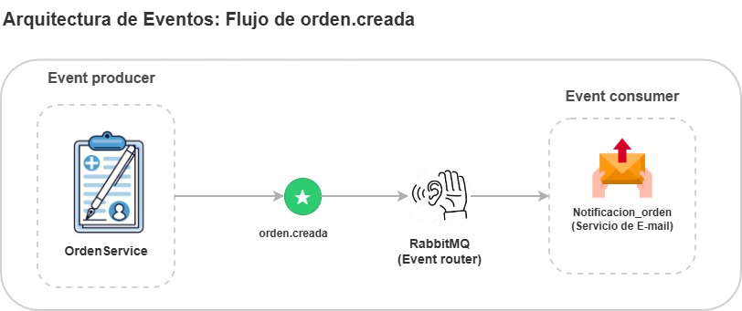

# Diagramas de Arquitectura - Módulo de Eventos

## Arquitectura General

Descripción general del sistema SalUD desplegado en **Azure for Students** con docker-compose.

### Componentes principales
- **Frontend**: React + Vite (Puerto 5173)
- **Backend**: Node.js / Express (Puerto 8000)
- **Base de datos**: PostgreSQL postgres:15-alpine (Puerto 5432)
- **Broker de eventos**: RabbitMQ (Puertos 5672/5671)
- **Notificacion_orden**: Worker Node.js, Consumidor AMQP, Nodemailer/SMTP

### Flujo principal
1. Paciente **gestiona citas médicas** → Frontend → Backend
2. Médico **gestiona atención a pacientes** → Backend publica `orden.creada`
3. RabbitMQ enruta el evento → `notificacion_orden` envía correo al paciente

---

## Arquitectura de Eventos: Flujo orden.creada

Detalle del flujo de eventos usando **RabbitMQ** como event router.

### Componentes
- **Event Producer**: `OrdenService` publica el evento `orden.creada`
- **Event Router**: RabbitMQ recibe y enruta el mensaje
- **Event Consumer**: `Notificacion_orden` (Servicio de E-mail)
