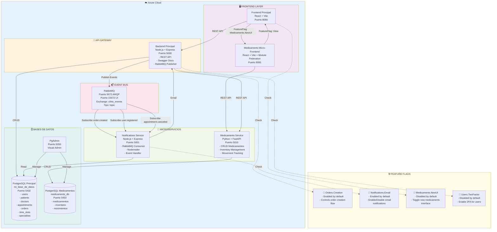
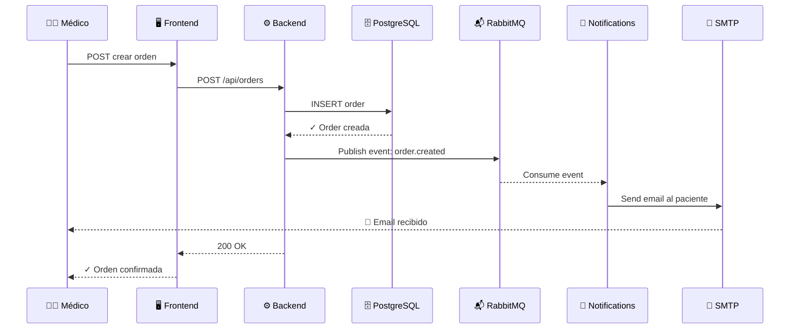
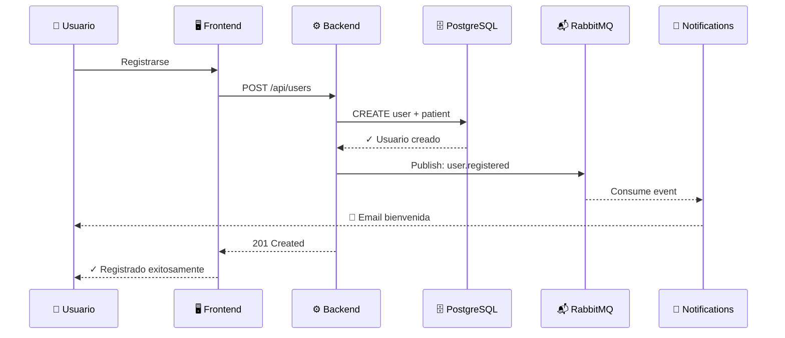
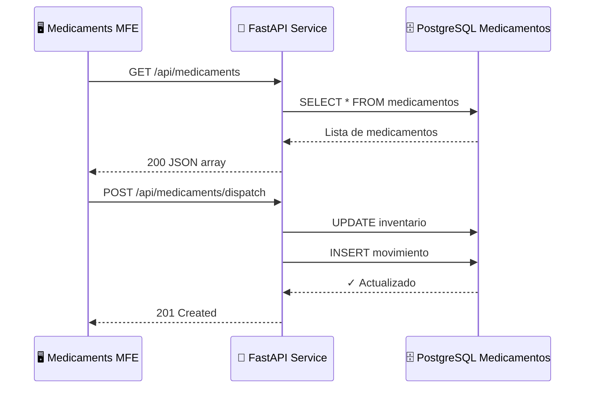

# 🏗️ Arquitectura de Microservicios - SalUD

**Rama:** `feature/#125`  
**Estado:** En Desarrollo  
**Fecha:** Mayo 2026

---

## 📋 Tabla de Contenidos
1. [Diagrama General](#diagrama-general)
2. [Componentes](#componentes)
3. [Feature Flags](#feature-flags)
4. [Flujos de Eventos](#flujos-de-eventos)
5. [Despliegue](#despliegue)

---

## 🎨 Diagrama General



---

## 📦 Componentes

### **Capa de Presentación** 🖥️

| Componente | Tecnología | Puerto | Responsabilidad |
|---|---|---|---|
| **Frontend Principal** | React + Vite | 8080 | UI principal, gestión de citas, usuarios, órdenes |
| **Medicaments MFE** | React + Vite + Module Federation | 8081 | Micro-frontend independiente para medicamentos |

---

### **Capa de Negocio (API Gateway)** 🚪

| Componente | Tecnología | Puerto | Responsabilidad |
|---|---|---|---|
| **Backend Principal** | Node.js + Express | 5000 | Orquesta toda la lógica: citas, usuarios, órdenes, especialidades; publica eventos |

**Endpoints Principales:**
```
POST   /api/users/login                              (Autenticación)
GET    /api/patients                                 (Listar pacientes)
GET    /api/doctors                                  (Listar doctores)
POST   /api/appointments                             (Crear cita)
PUT    /api/appointments/:id/cancel                  (Cancelar cita)
POST   /api/appointments/:id/complete                (Completar cita)
POST   /api/appointment-details                      (Registrar diagnóstico)
GET    /api/time-slots/available                     (Horarios disponibles)
POST   /api/orders                                   (Crear orden/autorización)
GET    /api/specialties                              (Especialidades médicas)
GET    /api-docs                                     (Swagger documentation)
```

---

### **Capa de Microservicios** 🔧

#### **1. Notifications Service**
| Aspecto | Detalle |
|---|---|
| **Tecnología** | Node.js + Express |
| **Puerto** | 5001 |
| **Función** | Consumir eventos y enviar notificaciones por email |
| **Eventos que consume** | `order.created`, `user.registered`, `appointment.canceled` |
| **Dependencia** | RabbitMQ + Nodemailer |

#### **2. Medicaments Service**
| Aspecto | Detalle |
|---|---|
| **Tecnología** | Python + FastAPI |
| **Puerto** | 5010 |
| **Función** | Gestión completa de medicamentos e inventario |
| **Endpoints** | `GET /api/medicaments`, `POST /api/medicaments/dispatch` |
| **BD** | PostgreSQL separada: `medicaments_db` (puerto 5433) |
| **ORM** | SQLAlchemy + Alembic (migraciones) |

---

### **Event Bus** 📬

| Componente | Detalle |
|---|---|
| **Broker** | RabbitMQ 3.13 |
| **Puerto AMQP** | 5672 |
| **Puerto UI** | 15672 (admin/admin123) |
| **Exchange** | `clinic_events` (tipo: topic, durable) |
| **Estrategia** | Pub/Sub pattern |
| **Eventos** | `order.created`, `user.registered`, `appointment.canceled`, `appointment.rescheduled` |

---

### **Bases de Datos** 🗄️

#### **PostgreSQL Principal**
```
Host: localhost:5432
Base de datos: mi_base_de_datos
Usuario: user_admin
Contraseña: super_password_123

Tablas:
├── users (Usuarios: pacientes y doctores)
├── patients (Extensión de users)
├── doctors (Extensión de users)
├── appointments (Citas médicas)
├── appointment_details (Diagnósticos, planes)
├── time_slots (Horarios disponibles)
├── orders (Órdenes médicas)
├── specialties (Especialidades)
├── roles (Roles de usuario)
└── role_user (Asociación roles-usuarios)
```

#### **PostgreSQL Medicamentos**
```
Host: localhost:5433
Base de datos: medicaments_db
Usuario: user_admin
Contraseña: super_password_123

Tablas:
├── medicamentos (Catálogo de medicamentos)
├── inventario (Stock actual)
└── movimientos (Historial de entradas/salidas)
```

#### **PgAdmin**
```
URL: http://localhost:5050
Usuario: admin@admin.com
Contraseña: admin
```

---

## 🚀 Feature Flags

Los feature flags permiten habilitar/deshabilitar funcionalidades sin despliegue.

### **Implementación**

```javascript
// backend/src/config/featureFlags.js
const FEATURE_FLAGS = {
  // Crear órdenes médicas
  'orders.creation': {
    enabled: true,
    description: 'Permite crear órdenes médicas'
  },
  
  // Notificaciones por email
  'notifications.email': {
    enabled: true,
    description: 'Envía notificaciones por email'
  },
  
  // Nueva interfaz de medicamentos
  'medicaments.newUI': {
    enabled: false,
    description: 'Activa micro-frontend de medicamentos v2'
  },
  
  // Autenticación de dos factores
  'users.twoFactor': {
    enabled: false,
    description: 'Habilita autenticación de dos factores'
  },
  
  // API Gateway para medicamentos
  'medicaments.gateway': {
    enabled: true,
    description: 'Enruta medicamentos a través de backend'
  },
  
  // Eventos asincronos
  'events.async': {
    enabled: true,
    description: 'Procesa eventos asincronamente'
  }
};

module.exports = FEATURE_FLAGS;
```

### **Uso en Código**

```javascript
// Backend
const { isFeatureEnabled } = require('./services/featureFlagService');

if (isFeatureEnabled('orders.creation')) {
  // Crear orden
  const order = await orderService.create(data);
}

if (isFeatureEnabled('notifications.email')) {
  // Enviar notificación
  await notificationService.sendEmail(user);
}
```

```javascript
// Frontend React
import { useFeatureFlag } from './hooks/useFeatureFlag';

function App() {
  const showMedicamentsUI = useFeatureFlag('medicaments.newUI');
  
  return (
    <>
      {showMedicamentsUI ? (
        <MedicamentsMicroFrontend />
      ) : (
        <LegacyMedicamentsView />
      )}
    </>
  );
}
```

### **Configuración en Docker**

```yaml
# infra/docker-compose.dev.yaml
environment:
  - FEATURE_FLAGS_ENABLED=orders.creation,notifications.email,medicaments.gateway,events.async
  - FEATURE_FLAGS_DISABLED=medicaments.newUI,users.twoFactor
```

---

## 📡 Flujos de Eventos

### **Flujo 1: Creación de Orden**



### **Flujo 2: Registro de Usuario**



### **Flujo 3: Gestión de Medicamentos**



---

## 🛠️ Stack Tecnológico

### **Backend Principal**
- Node.js + Express.js
- Sequelize ORM
- PostgreSQL 15
- RabbitMQ (amqplib)
- Nodemailer
- Swagger/OpenAPI
- Jest + Supertest (testing)
- Bcryptjs (hashing de contraseñas)

### **Microservicio Medicamentos**
- Python 3.9+
- FastAPI
- SQLAlchemy ORM
- Alembic (DB migrations)
- Pydantic (data validation)
- Pytest

### **Frontends**
- React 18+
- Vite (bundler)
- TypeScript
- Module Federation (micro-frontend)
- Axios (HTTP client)

### **Infraestructura**
- Docker + Docker Compose
- PostgreSQL 15
- RabbitMQ 3.13
- PgAdmin 4

---

## 🚀 Despliegue

### **Desarrollo Local**

```bash
cd arquitecturas/microservicios/infra

# Opción 1: Con variables de entorno
docker compose --env-file dev.env -f docker-compose.dev.yaml up -d --build

# Opción 2: Simple
docker compose -f docker-compose.dev.yaml up -d --build
```

### **URLs de Acceso (Local)**

| Servicio | URL |
|---|---|
| Frontend | http://localhost:8080 |
| Medicaments MFE | http://localhost:8081 |
| Backend API | http://localhost:5000 |
| API Docs (Swagger) | http://localhost:5000/api-docs |
| RabbitMQ Management | http://localhost:15672 |
| PgAdmin | http://localhost:5050 |

### **Producción (Azure)**

- **Frontend Principal:** Azure Static Apps
- **Backend + Servicios:** Azure Container Apps
- **Bases de datos:** Azure Database for PostgreSQL
- **Message Broker:** Azure Service Bus o RabbitMQ en Container

---

## 📊 Comparación con Arquitecturas Anteriores

| Característica | Cliente-Servidor | Eventos | Capas | **Microservicios** |
|---|---|---|---|---|
| **Servicios independientes** | ❌ | ❌ | ❌ | ✅ |
| **Escalabilidad** | Limitada | Media | Media | ✅ Alta |
| **Desacoplamiento** | Bajo | Alto | Medio | ✅ Muy alto |
| **Complejidad operacional** | Baja | Media | Media | ✅ Alta |
| **Múltiples BDs** | ❌ | ❌ | ✅ | ✅ |
| **Event-driven** | ❌ | ✅ | Parcial | ✅ |
| **Comunicación sync** | REST | REST | REST | ✅ REST + Async |
| **Lenguajes heterogéneos** | ❌ | ❌ | ❌ | ✅ (Node.js + Python) |

---

## 📝 Notas

- **Feature Flags:** Los feature flags se pueden configurar dinámicamente sin redeploy
- **RabbitMQ:** Es crítico para el desacoplamiento de servicios
- **Scaling:** Cada microservicio puede escalarse independientemente
- **Monitoreo:** Se recomienda implementar Prometheus + Grafana para observabilidad

---

**Última actualización:** Mayo 24, 2026  
**Rama:** feature/#125  
**Responsable:** Equipo SalUD
