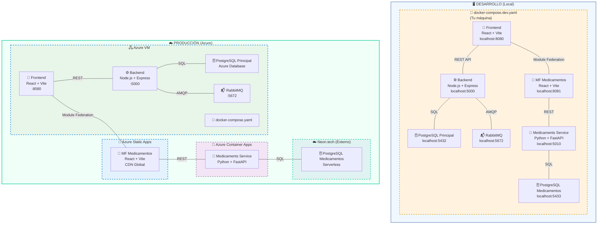

# 🔄 Arquitectura: Desarrollo vs Producción

**Propósito:** Mostrar cómo el mismo código se despliega de formas diferentes según el ambiente

---

## 📊 Diagrama Comparativo



---

## 🖥️ DESARROLLO (Local con Docker)

### **¿Qué pasa cuando ejecutas?**

```bash
cd arquitecturas/microservicios/infra
docker compose -f docker-compose.dev.yaml up -d --build
```

### **Resultado:**

Tu máquina (con Docker Desktop) crea **7 contenedores**:

```
Tu Computadora
│
├─ Docker Desktop (Virtual Machine)
│  │
│  ├─ Container: backend
│  │  ├─ Puerto: 5000
│  │  ├─ Código: Node.js + Express
│  │  └─ Conecta a: PostgreSQL (db), RabbitMQ
│  │
│  ├─ Container: frontend
│  │  ├─ Puerto: 8080
│  │  ├─ Código: React + Vite
│  │  └─ Conecta a: Backend (REST)
│  │
│  ├─ Container: medicaments-microfrontend
│  │  ├─ Puerto: 8081
│  │  ├─ Código: React + Vite (Micro-Frontend)
│  │  └─ Conecta a: medicaments-service (REST)
│  │
│  ├─ Container: medicaments-service
│  │  ├─ Puerto: 5010
│  │  ├─ Código: Python + FastAPI
│  │  └─ Conecta a: PostgreSQL Medicamentos (medicaments-db)
│  │
│  ├─ Container: notifications-service
│  │  ├─ Puerto: 5001
│  │  ├─ Código: Node.js Worker
│  │  └─ Conecta a: RabbitMQ (consume eventos)
│  │
│  ├─ Container: db (PostgreSQL Principal)
│  │  ├─ Puerto: 5432 (solo acceso interno)
│  │  ├─ Puerto: 5432 → localhost:5432 (desde tu máquina)
│  │  └─ Datos: Citas, Usuarios, Órdenes
│  │
│  ├─ Container: medicaments-db (PostgreSQL Medicamentos)
│  │  ├─ Puerto: 5432 (solo acceso interno)
│  │  ├─ Puerto: 5432 → localhost:5433 (desde tu máquina)
│  │  └─ Datos: Medicamentos, Inventario, Movimientos
│  │
│  ├─ Container: rabbitmq
│  │  ├─ Puerto: 5672 (AMQP - eventos)
│  │  ├─ Puerto: 15672 (UI Management)
│  │  └─ Broker: clinic_events (exchange)
│  │
│  ├─ Container: pgadmin (opcional)
│  │  └─ Puerto: 5050 (gestor visual de BD)
│  │
│  └─ Volúmenes (almacenamiento persistente)
│     ├─ node_modules (dependencias)
│     ├─ pgdata (datos BD principal)
│     ├─ medicaments_pgdata (datos BD medicamentos)
│     └─ rabbitmq_data (datos eventos)
```

### **Acceso desde tu navegador:**

```
Frontend:                http://localhost:8080
Backend API:             http://localhost:5000
Backend API Docs:        http://localhost:5000/api-docs
Medicamentos:            http://localhost:8081
Medicamentos API:        http://localhost:5010
RabbitMQ Management:     http://localhost:15672
PgAdmin:                 http://localhost:5050
```

### **Ventajas:**
✅ Todo en tu máquina  
✅ Fácil de desarrollar  
✅ Rápido de iterar  
✅ Sin costos  
✅ Aislado (no afecta producción)

---

## ☁️ PRODUCCIÓN (Azure Distribuido)

### **¿Qué pasa cuando despliegas?**

El código se distribuye en **múltiples máquinas de Azure**:

```
Azure Cloud
│
├─ Azure VM (Máquina Virtual)
│  └─ docker-compose.yaml
│     │
│     ├─ Container: backend (5000)
│     ├─ Container: frontend (8080)
│     ├─ Container: notifications-service
│     ├─ Azure PostgreSQL (BD Principal)
│     └─ Azure Service Bus → RabbitMQ equivalente
│
├─ Azure Static Apps (CDN Global)
│  └─ MF Medicamentos (8081)
│     ├─ Hosting: Global edge locations
│     ├─ Caché: Distribuido mundialmente
│     └─ Conecta a: medicamentos-service vía REST
│
├─ Azure Container Apps (Serverless)
│  └─ medicamentos-service (Python)
│     ├─ Auto-scaling según demanda
│     ├─ Puerto: Puerto interno 5010
│     └─ Conecta a: PostgreSQL Neon
│
└─ Neon.tech (Proveedor Externo)
   └─ PostgreSQL Serverless
      ├─ Escalado automático
      ├─ Backups automáticos
      └─ SQL: medicamentos-db
```

### **Diferencias clave:**

| Aspecto | Desarrollo | Producción |
|--------|-----------|-----------|
| **Ubicación** | Tu máquina | Servidores Azure (mundo) |
| **Acceso** | localhost:PUERTO | https://salud.app |
| **Escalabilidad** | Limitada a tu máquina | Auto-scaling |
| **Base de datos** | Docker local | Azure Database + Neon |
| **Storage** | SSD local | Azure Storage |
| **Backup** | Manual | Automático diario |
| **SSL/TLS** | No | Sí |
| **Monitoreo** | Logs Docker | Azure Monitor |
| **Costos** | $0 | $$ (Azure for Students) |

---

## 🔄 Flujo de Despliegue

```
1. DESARROLLO (Tu máquina)
   ├─ Escribes código
   ├─ Ejecutas: docker compose up
   ├─ Pruebas en http://localhost:8080
   └─ Haces push a GitHub

2. CI/CD (GitHub Actions)
   ├─ Ejecuta tests
   ├─ Construye imágenes Docker
   ├─ Sube a Azure Container Registry
   └─ Despliega a Azure

3. PRODUCCIÓN (Azure)
   ├─ Instancias corriendo
   ├─ Usuarios acceden a https://salud.app
   ├─ Monitoreo 24/7
   └─ Auto-scaling según tráfico
```

---

## 📋 Resumen de Servicios

### **En Ambos Ambientes (Código Idéntico):**

| Servicio | Stack | Función |
|----------|-------|---------|
| **backend** | Node.js + Express | API REST principal |
| **frontend** | React + Vite | Interfaz usuarios |
| **medicaments-service** | Python + FastAPI | API medicamentos |
| **medicaments-microfrontend** | React + Vite | UI medicamentos |
| **notifications-service** | Node.js | Consumidor RabbitMQ |

### **Solo en DESARROLLO:**

- Docker volumes (almacenamiento local)
- PgAdmin (gestor BD visual)
- Nodemon (auto-reload código)

### **Solo en PRODUCCIÓN:**

- Azure VMs (máquinas virtuales escalables)
- Azure Static Apps (CDN global)
- Azure Container Apps (serverless)
- Neon.tech (BD serverless)
- CI/CD automatizado

---

## 🎯 Flujo de Comunicación

### **DESARROLLO:**

```
Navegador (localhost:8080)
    ↓
Frontend (React)
    ↓
Backend (localhost:5000)
    ↓
PostgreSQL (localhost:5432)
```

### **PRODUCCIÓN:**

```
Navegador (https://salud.app)
    ↓
CDN Azure (Global)
    ↓
Frontend (Azure VM o Static Apps)
    ↓
Backend (Azure VM)
    ↓
Azure PostgreSQL + Neon
```

---

## 🚀 ¿Por qué dos ambientes?

### **Desarrollo:**
- Rápido de iterar
- Fácil de debuggear
- Sin costo
- Ambiente local aislado

### **Producción:**
- Disponible 24/7
- Escalable automáticamente
- Seguro y confiable
- Accesible a usuarios reales
- Respaldos automáticos

---

## 💡 Analogía

Imagina que **SalUD es un restaurante:**

**DESARROLLO (tu cocina casera):**
- Pruebas recetas en casa
- Tú eres el chef y el cliente
- Iteración rápida
- Cero costo

**PRODUCCIÓN (restaurante abierto):**
- Receta probada se sirve a clientes
- Múltiples mesas (servidores)
- Personal especializado (auto-scaling)
- Inspecciones de salud (monitoreo)
- Publicidad en lugares estratégicos (CDN global)

---

## 📌 Key Takeaway

El **código es exactamente el mismo** en desarrollo y producción.

Lo que cambia es:
- ✅ **DÓNDE** corre (tu máquina vs Azure)
- ✅ **CÓMO** escala (manual vs automático)
- ✅ **QUIÉN** puede acceder (tú vs el mundo)

El `docker-compose.yaml` es como un "receta" que se puede ejecutar en cualquier lugar. ✨

---

**Última actualización:** Mayo 24, 2026
