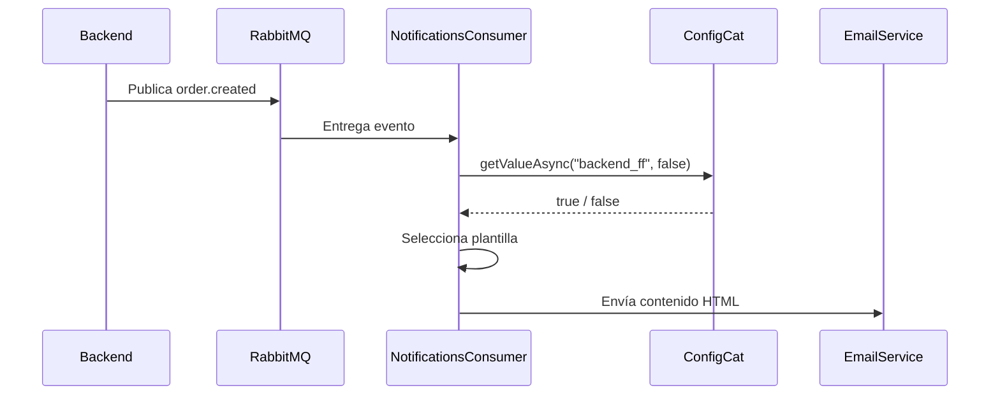

# Feature Flags con ConfigCat en el servicio de notificaciones

## Propósito

Este documento describe el uso de **Feature Flags** en la arquitectura de
microservicios de SalUD, con énfasis en la selección de la plantilla del correo
emitido por el servicio de notificaciones cuando se crea una orden médica.

| Elemento | Detalle |
|---|---|
| Servicio consumidor de la flag | `notifications-service` |
| Proveedor de Feature Flags | ConfigCat |
| Flag identificada en el código | `backend_ff` |
| Evento cubierto | `order.created` |
| Decisión controlada | Contenido tradicional o nueva plantilla del correo |
| Valor predeterminado solicitado al SDK | `false` |

## Qué son las Feature Flags en esta arquitectura

Una Feature Flag es un control de configuración que permite habilitar o
deshabilitar un comportamiento en tiempo de ejecución sin publicar una nueva
versión del servicio. En SalUD, ConfigCat centraliza el valor de la bandera y
el servicio de notificaciones lo consulta al procesar el evento que origina el
correo.

La flag no modifica la creación de la orden ni la entrega del evento a
RabbitMQ. Su responsabilidad se limita a seleccionar la presentación del
mensaje de correo que recibe el paciente.

## Por qué se usan en notificaciones

El correo es un punto visible para el usuario y un cambio de plantilla puede
requerir validación gradual. Una Feature Flag permite:

| Necesidad | Aporte de la flag |
|---|---|
| Publicar una nueva interfaz de correo con menor riesgo | Activarla después del despliegue y desactivarla rápidamente si se detectan problemas |
| Comparar presentación tradicional y renovada | Conservar ambas variantes mientras se valida la nueva experiencia |
| Separar despliegue de liberación funcional | Desplegar la implementación antes de exponer la nueva plantilla |

## Problema resuelto

El texto o presentación del correo debía
ser liberado como un cambio de código. La flag `backend_ff` permite que una
misma versión del servicio elija entre:

| Valor de `backend_ff` | Resultado |
|---|---|
| `false` / OFF | Envía la plantilla tradicional de confirmación de orden. |
| `true` / ON | Envía la nueva plantilla, con mensaje ampliado y presentación renovada. |

El comportamiento se aplica actualmente al manejo de órdenes médicas que
publican el evento `order.created`.

## Integración con ConfigCat

El servicio importa `@configcat/sdk` y crea un cliente con la variable de
entorno `CONFIG_CAT_KEY`. El cliente utiliza `AutoPoll`, por lo cual obtiene
configuración desde ConfigCat en segundo plano. Durante la atención del evento
`order.created`, el consumidor ejecuta:

```js
configCatClient.getValueAsync("backend_ff", false)
```

El segundo argumento expresa el valor predeterminado solicitado por la
implementación cuando la configuración no puede evaluarse como activa:
mantener la plantilla tradicional.



## Configuración necesaria

| Variable | Servicio | Propósito | Observación |
|---|---|---|---|
| `CONFIG_CAT_KEY` | `notifications-service` | Autenticar el SDK y consultar `backend_ff` en ConfigCat. | Identificada en el cliente y en el compose de desarrollo. Debe tratarse como secreto. |
| `RABBITMQ_URL` | `notifications-service` | Consumir `order.created`. | Necesaria para disparar el flujo de correo, aunque no pertenece a ConfigCat. |

> **Seguridad:** las SDK keys y las credenciales de envío no deben copiarse a
> capturas, documentos, tickets ni registros públicos. Se recomienda
> administrarlas mediante secretos del ambiente de despliegue.

## Activación y desactivación

### Prerrequisitos

1. Confirmar que el ambiente del servicio dispone de `CONFIG_CAT_KEY`.
2. Confirmar que el dashboard de ConfigCat contiene la flag `backend_ff` de
   tipo booleano.
3. Disponer de acceso controlado al ambiente y de un caso de orden médica para
   validar el correo resultante.

### Activar la nueva plantilla

1. Ingresar al dashboard de ConfigCat del ambiente correspondiente.
2. Localizar la flag `backend_ff`.
3. Establecer su valor en `true` (ON) para el alcance autorizado.
4. Esperar la actualización del cliente con `AutoPoll`.
5. Crear una orden médica que genere `order.created` y verificar que el correo
   presenta el contenido renovado.

### Volver a la plantilla tradicional

1. Establecer `backend_ff` en `false` (OFF) en ConfigCat.
2. Esperar la actualización del cliente.
3. Generar una nueva orden válida.
4. Confirmar que el correo vuelve al contenido tradicional.

## Prueba rápida del comportamiento ON/OFF

| Paso | Flag | Acción | Resultado esperado |
|---|---|---|---|
| 1 | OFF | Crear una orden médica asociada a una especialidad y una cita válida. | Se publica `order.created` y el correo contiene el texto tradicional. |
| 2 | ON | Repetir el flujo con otra orden válida. | El correo contiene la plantilla renovada. |
| 3 | OFF | Desactivar nuevamente la flag y repetir la creación. | La plantilla tradicional se recupera sin redesplegar el servicio. |

Para comprobar el valor evaluado, el consumidor actualmente registra
`backend_ff: true` o `backend_ff: false` en los logs. La evidencia funcional
principal debe ser el correo recibido, con cualquier dato sensible oculto.

## Documentos relacionados

| Documento | Descripción |
|---|---|
| [feature-flag-notificaciones.md](feature-flag-notificaciones.md) | Ficha funcional y técnica de `backend_ff`. |
| [adr-feature-flags-configcat.md](adr-feature-flags-configcat.md) | Decisión arquitectónica de uso de ConfigCat. |
| [testing-feature-flag-notificaciones.md](testing-feature-flag-notificaciones.md) | Casos de prueba y evidencias requeridas. |